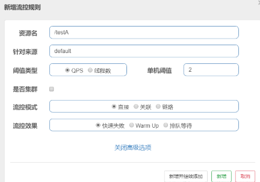

# 前言
Sentinel是阿里于18年开源的面向分布式服务架构的流量控制组件，主要以流量为切入点，目前至少有80+主流企业使用其以保障微服务的稳定性。

# 快速上手
maven:
```
<dependency>
    <groupId>com.alibaba.csp</groupId>
    <artifactId>sentinel-core</artifactId>
    <version>1.8.0</version>
</dependency>
```
dashboard控制台：https://github.com/alibaba/Sentinel/releases
```
java -jar ./sentinel-dashboard-1.8.0.jar
```
控制台：http://localhost:8080/#/dashboard/home

配置yml:
```yaml
spring:
  application:
    name: cloud-sentinel-service
  cloud:
    sentinel:
      transport:
        dashboard: localhost:8080 #配置Sentinel dashboard地址
        port: 8719 #默认8719，如果被占用会从8719开始扫描+1直到找到未被占用的端口
 
# 图形化界面监控
management:
  endpoints:
    web:
      exposure:
        include: '*'
```

# 主要流控规则、熔断降级规则、热点规则
https://sentinelguard.io/zh-cn/docs/basic-api-resource-rule.html
## 流控规则

- 资源名：唯一名称，默认请求路径
```java
// 通过@SentinelResource配置value
 @SentinelResource(value = "testA")
```
- 针对来源：Sentinel可以针对调用者进行限流，填写微服务名，指定对哪个微服务进行限流 ，默认default(不区分来源，全部限制)
- 阈值类型/单机阈值：
    1. QPS(每秒钟的请求数量)：当调用该接口的QPS达到了阈值的时候，进行限流；
    2. 线程数：当调用该接口的线程数达到阈值时，进行限流
- 是否集群：不需要集群
- 流控模式：
    1. 直接：接口达到限流条件时，直接限流
    2. 关联：当关联的资源达到阈值时，就限流自己（A调用B接口，B到达阈值，A限流）
    3. 链路：只记录指定链路上的流量（指定资源从入口资源进来的流量，如果达到阈值，就可以限流）（api级别的针对来源）
- 流控效果
    1. 快速失败：直接失败
    2. Warm Up：即请求 QPS 从 threshold / 3 开始，经预热时长逐渐升至设定的 QPS 阈值
    3. 排队等待：超过阈值就排队等待，等待的超时单位为ms，目的是为了匀速处理请求，保证服务的均匀性
    
    
## 降级规则

- 慢调用比例 (SLOW_REQUEST_RATIO)：选择以慢调用比例作为阈值，需要设置允许的慢调用 RT（即最大的响应时间），请求的响应时间大于该值则统计为慢调用。当单位统计时长（statIntervalMs）内请求数目大于设置的最小请求数目，并且慢调用的比例大于阈值，则接下来的熔断时长内请求会自动被熔断。经过熔断时长后熔断器会进入探测恢复状态（HALF-OPEN 状态），若接下来的一个请求响应时间小于设置的慢调用 RT 则结束熔断，若大于设置的慢调用 RT 则会再次被熔断。
- 异常比例 (ERROR_RATIO)：当单位统计时长（statIntervalMs）内请求数目大于设置的最小请求数目，并且异常的比例大于阈值，则接下来的熔断时长内请求会自动被熔断。经过熔断时长后熔断器会进入探测恢复状态（HALF-OPEN 状态），若接下来的一个请求成功完成（没有错误）则结束熔断，否则会再次被熔断。异常比率的阈值范围是 [0.0, 1.0]，代表 0% - 100%。
- 异常数 (ERROR_COUNT)：当单位统计时长内的异常数目超过阈值之后会自动进行熔断。经过熔断时长后熔断器会进入探测恢复状态（HALF-OPEN 状态），若接下来的一个请求成功完成（没有错误）则结束熔断，否则会再次被熔断。


|Field|说明	|默认值	|
|----|----|----|
resource|资源名，即规则的作用对象|  
grade|熔断策略，支持慢调用比例/异常比例/异常数策略|慢调用比例
count|慢调用比例模式下为慢调用临界 RT（超出该值计为慢调用）；异常比例/异常数模式下为对应的阈值   |
timeWindow|熔断时长，单位为 s|
minRequestAmount|熔断触发的最小请求数，请求数小于该值时即使异常比率超出阈值也不会熔断（1.7.0 引入）|5
statIntervalMs|统计时长（单位为 ms），如 60*1000 代表分钟级（1.8.0 引入）|1000 ms
slowRatioThreshold|慢调用比例阈值，仅慢调用比例模式有效（1.8.0 引入）  |

## 热点规则
热点规则可以根据你的参数某些值来区分不同的qps，如根据参数值来请求不同的服务，不同的服务qps承载能力各不相同。
热点可以和限流并存，如果配置了热点，热点的优先级更加高。
```
 /**
     * 根据不同的类型走不同的qps
     * @return
     */
    @GetMapping(value = "/test2")
    @SentinelResource(value = "test2",blockHandler = "blockHandler2")
    public String test2(@RequestParam(value = "p1", required = false) String p1,
                        @RequestParam(value = "p2", required = false) String p2) {
        return "123";
    }
```

如果没有p1字段，直接走原有限流规则为；
如果p1有值，并且p1=3，则走限流qps为3的规则，其他会同时走限流为1和热点为2的规则。

## @SentinelResource 注解

@SentinelResource 用于定义资源，并提供可选的异常处理和 fallback 配置项。 @SentinelResource 注解包含以下属性：

- value：资源名称，必需项（不能为空），如果不填，会自动以全路径为key。
- entryType：entry 类型，可选项（默认为 EntryType.OUT）
- blockHandler / blockHandlerClass: blockHandler 对应处理 BlockException 的函数名称，可选项。blockHandler 函数访问范围需要是 public，返回类型需要与原方法相匹配，参数类型需要和原方法相匹配并且最后加一个额外的参数，类型为 BlockException。blockHandler 函数默认需要和原方法在同一个类中。若希望使用其他类的函数，则可以指定 blockHandlerClass 为对应的类的 Class 对象，注意对应的函数必需为 static 函数，否则无法解析。
fallback：fallback 函数名称，可选项，用于在抛出异常的时候提供 fallback 处理逻辑。fallback 函数可以针对所有类型的异常（除了 exceptionsToIgnore 里面排除掉的异常类型）进行处理。fallback 函数签名和位置要求：
返回值类型必须与原函数返回值类型一致；
方法参数列表需要和原函数一致，或者可以额外多一个 Throwable 类型的参数用于接收对应的异常。
- fallback 函数默认需要和原方法在同一个类中。若希望使用其他类的函数，则可以指定 fallbackClass 为对应的类的 Class 对象，注意对应的函数必需为 static 函数，否则无法解析。
- defaultFallback（since 1.6.0）：默认的 fallback 函数名称，可选项，通常用于通用的 fallback 逻辑（即可以用于很多服务或方法）。默认 fallback 函数可以针对所以类型的异常（除了 exceptionsToIgnore 里面排除掉的异常类型）进行处理。若同时配置了 fallback 和 defaultFallback，则只有 fallback 会生效。defaultFallback 函数签名要求：
返回值类型必须与原函数返回值类型一致；
方法参数列表需要为空，或者可以额外多一个 Throwable 类型的参数用于接收对应的异常。
defaultFallback 函数默认需要和原方法在同一个类中。若希望使用其他类的函数，则可以指定 fallbackClass 为对应的类的 Class 对象，注意对应的函数必需为 static 函数，否则无法解析。
- exceptionsToIgnore（since 1.6.0）：用于指定哪些异常被排除掉，不会计入异常统计中，也不会进入 fallback 逻辑中，而是会原样抛出。

# xcloud之sentinel
maven:
```
    <dependency>
        <groupId>cn.xdf.xcloud</groupId>
        <artifactId>xcloud-starter-sentinel</artifactId>
    </dependency>
```
yml:
```
 xcloud:
  sentinel:
    # 所有在`urlBlockHandlers`中没有找到的Controller的默认资源规则的处理
    defaultUrlBlockHandler:
      httpStatus: 429
      responseBody: "block by xcloud-sentinel"
    # 定义Controller中具体资源的特定返回
    urlBlockHandlers:
      - resource: "/sentinelC/test"
        httpStatus: 429
        responseBody: "block by customized!!!"
 
    # 定义规则 限流
    flowRules:
      - resource: "/sentinelC/test"
        enable: true
        grade: 1
        count: 1
        controlBehavior: 0
 
    # 熔断
    degradeRules:
      - resource: "/sentinelC/test"
        enable: true
        count: 2
        grade: 2
        timeWindow: 10
```
如果规则配置在了apollo，引入实现热加载
```
<dependency>
    <groupId>cn.xdf.xcloud</groupId>
    <artifactId>xcloud-starter-configcenter</artifactId>
</dependency>
```
# Sentinel原理剖析
在 Sentinel 里面，所有的资源都对应一个资源名称以及一个 Entry。Entry 可以通过对主流框架的适配自动创建，也可以通过注解的方式或调用 API 显式创建；每一个 Entry 创建的时候，同时也会创建一系列功能插槽（slot chain）。这些插槽有不同的职责，例如:
- NodeSelectorSlot 负责收集资源的路径，并将这些资源的调用路径，以树状结构存储起来，用于根据调用路径来限流降级；
- ClusterBuilderSlot 则用于存储资源的统计信息以及调用者信息，例如该资源的 RT, QPS, thread count 等等，这些信息将用作为多维度限流，降级的依据；
- StatisticSlot 则用于记录、统计不同纬度的 runtime 指标监控信息；
- FlowSlot 则用于根据预设的限流规则以及前面 slot 统计的状态，来进行流量控制；
- AuthoritySlot 则根据配置的黑白名单和调用来源信息，来做黑白名单控制；
- DegradeSlot 则通过统计信息以及预设的规则，来做熔断降级；
- SystemSlot 则通过系统的状态，例如 load1 等，来控制总的入口流量；

在*com.alibaba.csp.sentinel.CtSph#lookProcessChain*中，去获取到一条处理链，去执行资源的整合处理:
                                                    
- 对参全局配置项做检测，如果不符合要求就直接返回了一个CtEntry对象，不会再进行后面的限流检测，否则进入下面的检测流程。
- 根据包装过的资源对象获取对应的SlotChain
- 执行SlotChain的entry方法，如果SlotChain的entry方法抛出了BlockException，则将该异常继续向上抛出，如果SlotChain的entry方法正常执行了，则最后会将该entry对象返回
- 如果上层方法捕获了BlockException，则说明请求被限流了，否则请求能正常执行
```
ProcessorSlot<Object> lookProcessChain(ResourceWrapper resourceWrapper) {
        // chainMap一个volatile map
        ProcessorSlotChain chain = chainMap.get(resourceWrapper);
        if (chain == null) {
            // 不存在就加锁，获取，赋值
            synchronized (LOCK) {
                chain = chainMap.get(resourceWrapper);
                if (chain == null) {
                    // Entry size limit.
                    // 设置上限6000，提升性能
                    if (chainMap.size() >= Constants.MAX_SLOT_CHAIN_SIZE) {
                        return null;
                    }
 
                    chain = SlotChainProvider.newSlotChain();
                    Map<ResourceWrapper, ProcessorSlotChain> newMap = new HashMap<ResourceWrapper, ProcessorSlotChain>(
                        chainMap.size() + 1);
                    newMap.putAll(chainMap);
                    newMap.put(resourceWrapper, chain);
                    chainMap = newMap;
                }
            }
        }
        return chain;
    }
```
如果资源不存在，创建slot,包含前文所指的不同职责的插槽
```
    @Override
    public ProcessorSlotChain build() {
        ProcessorSlotChain chain = new DefaultProcessorSlotChain();
        chain.addLast(new NodeSelectorSlot());
        chain.addLast(new ClusterBuilderSlot());
        chain.addLast(new LogSlot());
        chain.addLast(new StatisticSlot());
        chain.addLast(new SystemSlot());
        chain.addLast(new AuthoritySlot());
        chain.addLast(new FlowSlot());
        chain.addLast(new DegradeSlot());
 
        return chain;
    }
```
在*com.alibaba.csp.sentinel.slots.statistic.StatisticSlot#entry*进行规则校验
```
public void entry(Context context, ResourceWrapper resourceWrapper, DefaultNode node, int count,
                      boolean prioritized, Object... args) throws Throwable {
        try {
            // Do some checking. 传播到下一个Slot
            fireEntry(context, resourceWrapper, node, count, prioritized, args);
　　　　　　  // 执行到这里表示通过检查，不被限流
            // Request passed, add thread count and pass count.
            node.increaseThreadNum();
            node.addPassRequest(count);
 
            if (context.getCurEntry().getOriginNode() != null) {
                // Add count for origin node.
                context.getCurEntry().getOriginNode().increaseThreadNum();
                context.getCurEntry().getOriginNode().addPassRequest(count);
            }
 
            if (resourceWrapper.getEntryType() == EntryType.IN) {
                // Add count for global inbound entry node for global statistics.
                Constants.ENTRY_NODE.increaseThreadNum();
                Constants.ENTRY_NODE.addPassRequest(count);
            }
 
            // Handle pass event with registered entry callback handlers.
            for (ProcessorSlotEntryCallback<DefaultNode> handler : StatisticSlotCallbackRegistry.getEntryCallbacks()) {
                handler.onPass(context, resourceWrapper, node, count, args);
            }
        } catch (PriorityWaitException ex) {　　　　　　  ....省略部分代码　　　　　　  //增加线程统计
            node.increaseThreadNum();
        } catch (BlockException e) {　　　　　　　....省略部分代码
            // Blocked, set block exception to current entry.
            context.getCurEntry().setError(e);
            // Add block count.
            node.increaseBlockQps(count);
        } catch (Throwable e) {
　　　　　　　....省略部分代码// This should not happen.
            node.increaseExceptionQps(count);
        }
    }
```
成功校验后会执行：
```
Constants.ENTRY_NODE.increaseThreadNum();
Constants.ENTRY_NODE.addPassRequest(count);
```
## 滑动窗口限流算法
目前主流限流的算法有：漏桶，令牌桶，滑动窗口。而Sentinel使用的就是滑动窗口，针对每秒滑动窗口有2个，每个500ms，针对每分钟滑动窗口有60个，每秒1个，对应代码：
```
private transient volatile Metric rollingCounterInSecond = new ArrayMetric(2, 1000);
private transient Metric rollingCounterInMinute = new ArrayMetric(60, 60 * 1000);
```

初始的时候arrays数组中只有一个窗口(可能是第一个，也可能是第二个)，每个时间窗口的长度是500ms，这就意味着只要当前时间与时间窗口的差值在500ms之内，时间窗口就不会向前滑动。例如，假如当前时间走到300或者500时，当前时间窗口仍然是相同的那个：

时间继续往前走，当超过500ms时，时间窗口就会向前滑动到下一个，这时就会更新当前窗口的开始时间：

时间继续往前走，只要不超过1000ms，则当前窗口不会发生变化：

当时间继续往前走，当前时间超过1000ms时，就会再次进入下一个时间窗口，此时arrays数组中的窗口将会有一个失效，会有另一个新的窗口进行替换：


参考资料：
>Hystrix和Sentinel以及Sentinel原理剖析 https://blog.csdn.net/pengbin790000/article/details/112271919 \
>sentinel https://sentinelguard.io/zh-cn/ \
